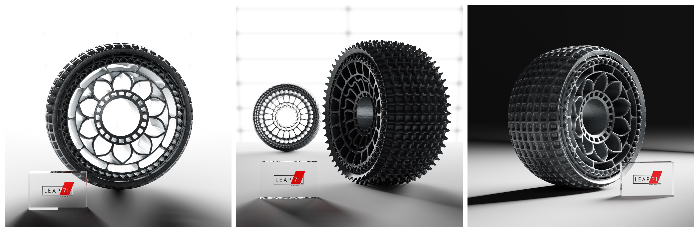
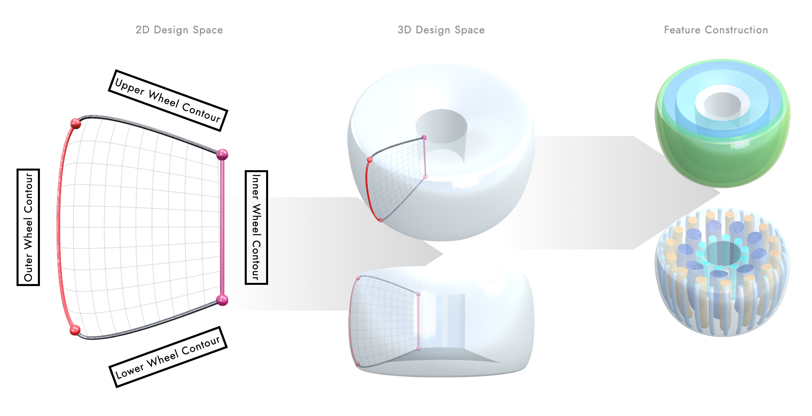
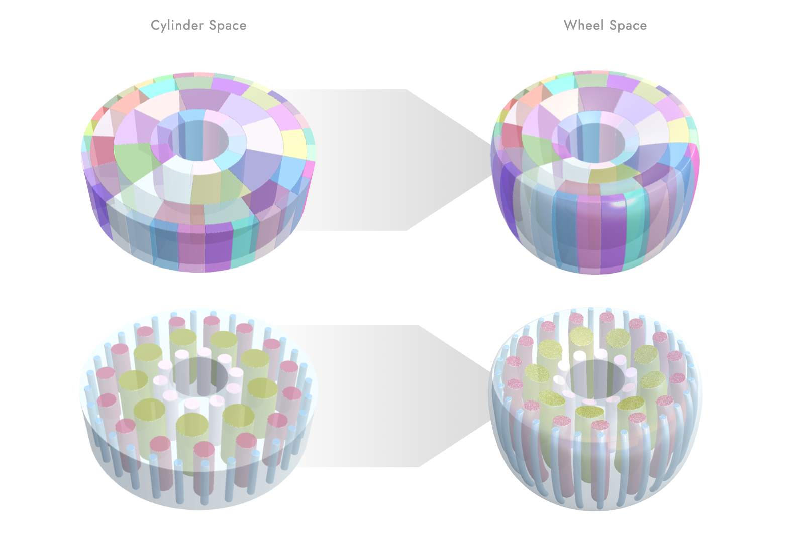
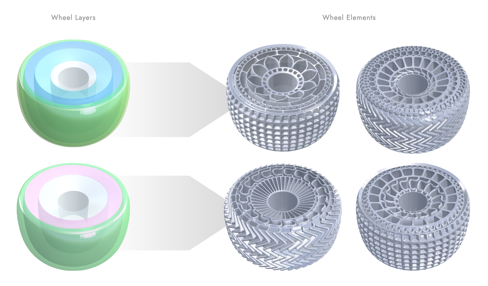
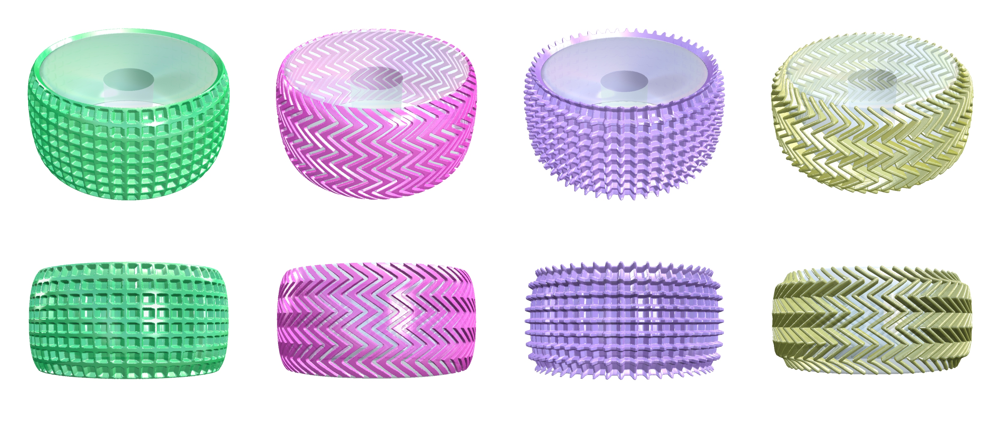
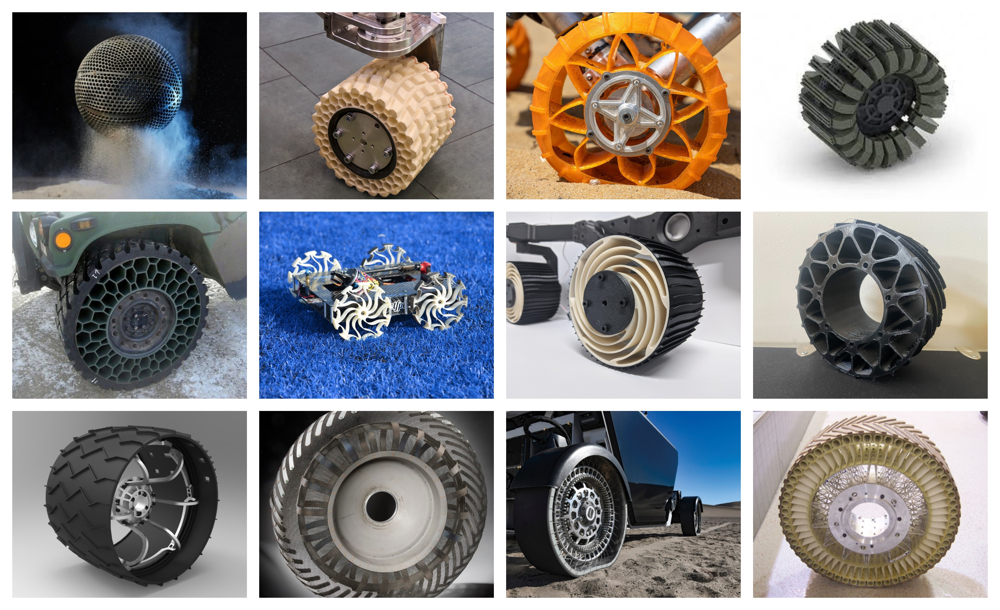
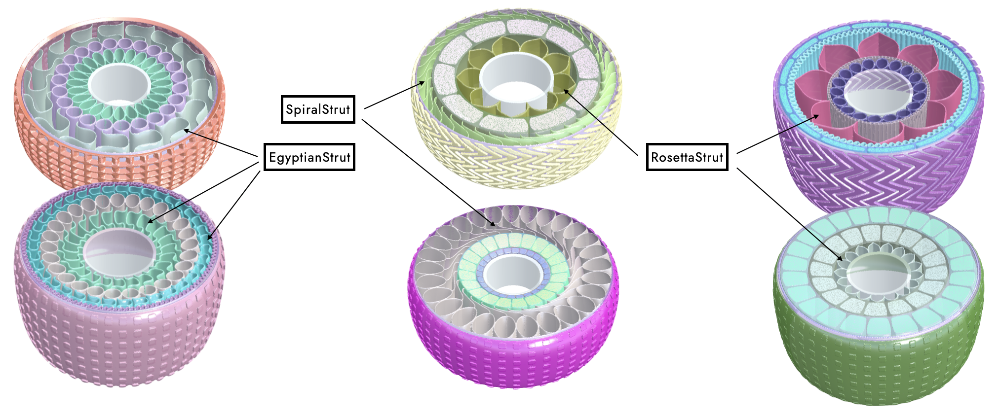
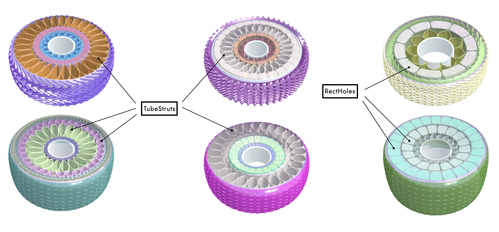
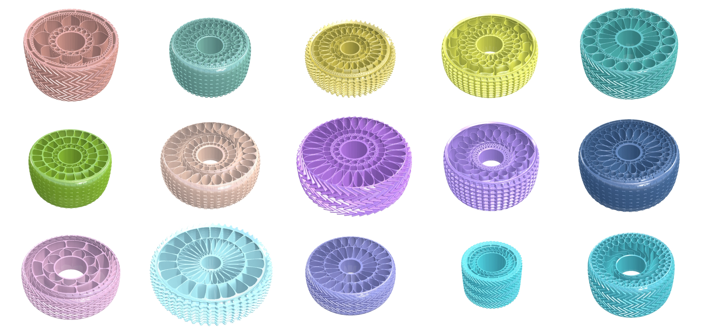

# Rover Wheels

### Prep

This is a small library for generating rover wheel geometries using the [PicoGK](https://github.com/leap71/PicoGK) engine and the [ShapeKernel](https://github.com/leap71/LEAP71_ShapeKernel) library. This is an excercise to demonstrate how a modular latticing-like workflow and the concept of coordinate transformations can be applied to create complex, neatly curved wheels. Think of the wheels as made from soft, rubbery material, where their springiness / stiffness is a function of the shape and wall thickness of the individual elements that you see within.





### Getting Started

Pick one option of how to add this library to your project:

- Beginner
  - download the RoverWheel library source code as zip file from https://github.com/leap71/LEAP71_RoverWheel
  - un-zip and copy the files into your VS project folder
- Pro
  - add RoverWheel library as a submodule, linking the Github repo: https://github.com/leap71/LEAP71_RoverWheel

There are two Task functions that get you started. If you call `WheelShowCase.PresetWheelTask()` one of four preset wheel variants will be generated. If you call `WheelShowCase.RandomWheelTask()` you can take your chance at a randomized wheel. Your Program.cs should look like this: 

```c#
using Leap71.ShapeKernel;
using Leap71.RoverExamples;
using PicoGK;

try
{
    PicoGK.Library.Go(
        0.5f,
        WheelShowCase.PresetWheelTask);
}
catch (Exception e)
{
    Console.WriteLine("Failed to run Task.");
    Console.WriteLine(e.ToString());
}
```

### Wheel Contours and Design Space

A wheel is initially described via its inner hub radius, its maximum outer radius and a reference width. The latter parameter drives the side contours that can vary the wheel's width along the radial dimension. We picture the wheel lying flat on the ground (z-plane) and consider one side of the width contour as the upper side  and the other as the lower side. When following the side contour radially outwards, we will arrive at a point where the contour is more alinged with the vertical axis than with the radial direction. We mark this point as the transition to what we derive as the outer wheel contour. This patch will eventually become the wheel's tread. The centre hub radius is a constant and provides the inner contour. With these four contours, we can span a 2D design space and rotate it to receive a 3D design space that is conformal to the wheel's shape. 



This design space provides the means by which we can navigate through and across the wheel body. By using this coordinate space, we can design simple wheel features in cylindrical coordinates and transform them to achieve confomity with the outer wheel shape. The image below illustrates the effect of such a coordinate transformation on layer segments and rows of circular holes.



Similarly, the wheel is first divided into layers that occupy a range within that is defines via its start and end radius ratio. These sections provide the bounding space for the actual wheel elements. This is how you can specify a new layer of the type `WheelLayer` and obtain its bounding shape as a voxelfield:

```c#
float fStartRadiusRatio = 0.5f;
float fEndRadiusRatio   = 0.8f;
WheelLayer sLayer       = new WheelLayer(this, fStartRadiusRatio, fEndRadiusRatio);
Voxels voxLayer         = voxGetLayer(sLayer);
```

The idea is to make this wheel design very flexible, almost like a latticing workflow, where infill types (holes, springs, stiffeners) can be applied to a bouding shape or a layer with a specified symmetry and wall / strut thickness. The image below shows how the selection and distribution of layers can be independent of the infill types chosen, resulting a powerful and flexible mix-and-match workflow. The wheel elements to choose from are listed in the next section.



### Wheel Tread

The wheel treads are the sturdy outer layers that interact with the terrain and provide traction and protection. These patterns are applied to the surface obtained from rotating the outer wheel contour. A similar workflow allows to design different profile patterns on a cylindrical surface and map the resulting shapes onto the wheel shape. The image below shows some exemplary profile patterns.



The logic of each tread pattern in contained in a class that inherits from the interface `ITreadPattern`. Three examples are currently implemented. The class `WheelTread` takes the pattern and offers the ability to either generate an exposed profile (only the pattern standing out) or inversely an inwards embossed tread layer (subtracts the pattern from a solid layer). These are the two options you can choose from:

```c#
//select tread pattern
ITreadPattern xPattern  = new TreadPattern_01();
WheelTread oTread       = new WheelTread(m_aOuterRadiusFrames, xPattern);

//choose exposed profile
Voxels voxTread         = oTread.voxGetProfile();

//choose embossed solid layer
Voxels voxTread         = oTread.voxGetTreadLayer();
```

### Wheel Elements



We took inspiration from a bunch of rover wheel designs that one can find on the internet. Often they feature radial, repetitive patterns. Each pattern "lives" in a dedicated layer. Well knowing that there are many more possible elements, these are the ones that you can currently choose from:

- `EgyptianStruts`
- `RectHoles`
- `RosettaStruts`
- `SpiralStruts`
- `TubeStruts`

The images below give you an idea of the shapes that each type of element can take:






Each from the listed wheel element classes is derived from an abstract base class, called `WheelElements`, can be easily extended and use a wheel layer, a symmetry and a wall thickness as inputs. This is how you can "infill" a wheel layer with a certain kind of wheel element:

```c#
uint nSymmetry          = 20;
float fWallThickness    = 2f;
WheelElements oElements = new RectHoles(sLayer, nSymmetry, fWallThickness);
Voxels voxStruts        = oElements.voxConstruct();
```

As illustrated in the section above, the shapes of the elements are constructed with respect to a regular cylindrical boundary. This simplifies the math and the complexity of placing the shapes within. Whether an individual element is constructed from a `Lattice` object or from a number of BaseShapes, you will find the call for `RoverWheel.vecGetWheelLayerTrafo` in one or another way in each of these classes. This is the coordinate transformation that translates the basic cylindrical arrangement into our nicely curved wheel coordinate space. If you toggle `RoverWheel.vecGetDummyTrafo` instead, the resulting shape will be displayed in regular cylindrical space.

### Randomized Wheels

The `RandomWheel` class will generate a random outer shape, filled with stacked layers of random thicknesses and filled with randomly selected wheel elements (with random symmetry and wall thickness). Since there is not a lot of logic in what combinations possibly make sense, not every single variant will be totally valid, but it might spark your ideas about a more carefully engineered version. The image below shows a best-off:



Now, it's your turn!